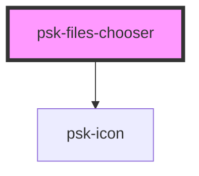

# psk-files-chooser

<!-- Auto Generated Below -->

## Properties

| Property      | Attribute      | Description | Type      | Default          |
| ------------- | -------------- | ----------- | --------- | ---------------- |
| `accept`      | `accept`       |             | `string`  | `undefined`      |
| `eventName`   | `event-name`   |             | `string`  | `undefined`      |
| `filesAppend` | `files-append` |             | `boolean` | `false`          |
| `label`       | `label`        |             | `string`  | `"Select files"` |
| `listFiles`   | `list-files`   |             | `boolean` | `false`          |

## Dependencies

### Depends on

- [psk-icon](../psk-icon)

### Graph

----------------------------------------------

*Built with [StencilJS](https://stenciljs.com/)*
